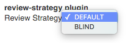
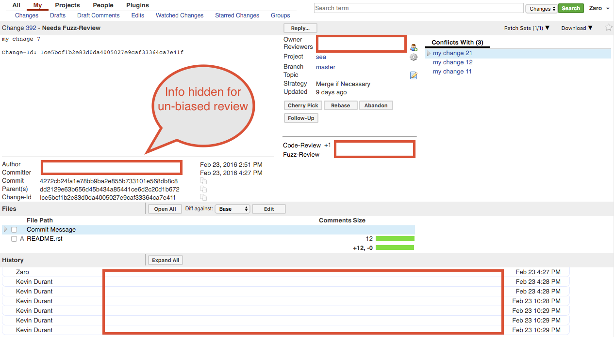

The @PLUGIN@ plugin allows users to configure a different review strategies.

User can configure the label UI under `Settings` > `Preferences` >
`Review Strategy`:

### `DEFAULT`

This is the one that come out of the box with Gerrit.  All of the information
for a change is shown to the user for a review.

### `BLIND`

This strategy hides some information from the user to facilitate an un-biased
review of changes.  Many scientific paper reviews are done this way.

